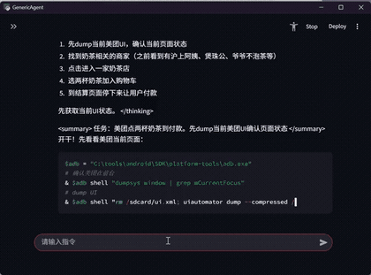
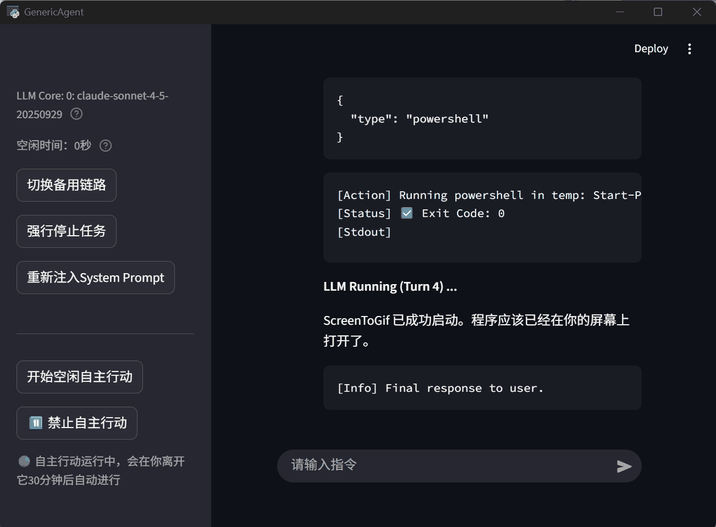
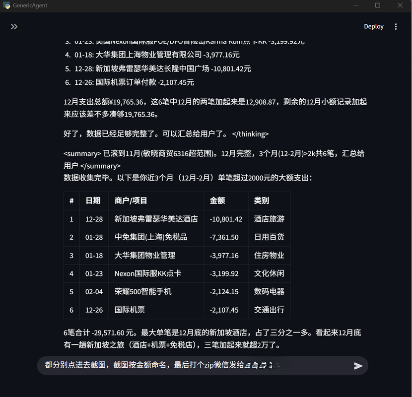
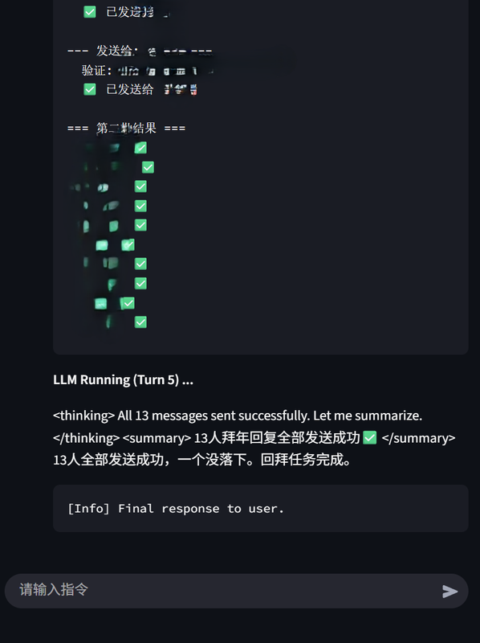
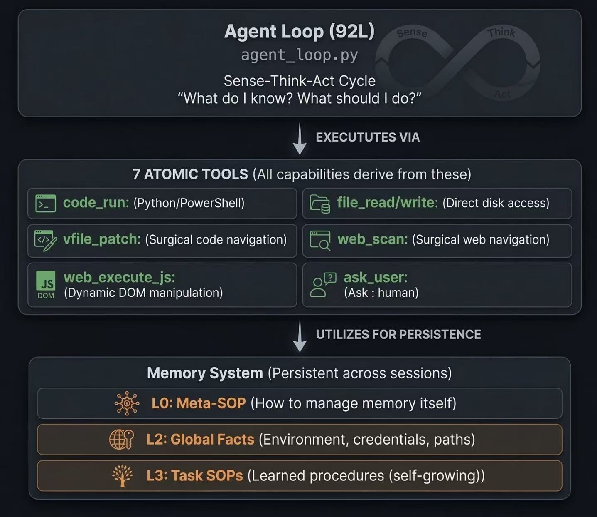

<div align="center">


<a href="https://trendshift.io/repositories/25944" target="_blank"></a>

</div>

<p align="center">
  <a href="#english">English</a> | <a href="#chinese">中文</a> | 📄 Technical Report:&nbsp;<a href="https://arxiv.org/abs/2604.17091"></a>&nbsp;<a href="assets/GenericAgent_Technical_Report.pdf"></a>&nbsp;<a href="https://github.com/JinyiHan99/GA-Technical-Report"></a> | 📘 <a href="https://datawhalechina.github.io/hello-generic-agent/">教程</a>
</p>

---
<a name="english"></a>
## 🌟 Overview

**wlwl-ass** is a minimal, self-evolving autonomous agent framework. Its core is just **~3K lines of code**. Through **9 atomic tools + a ~100-line Agent Loop**, it grants any LLM system-level control over a local computer — covering browser, terminal, filesystem, keyboard/mouse input, screen vision, and mobile devices (ADB).

Its design philosophy: **don't preload skills — evolve them.**

Every time wlwl-ass solves a new task, it automatically crystallizes the execution path into an skill for direct reuse later. The longer you use it, the more skills accumulate — forming a skill tree that belongs entirely to you, grown from 3K lines of seed code.

> **🤖 Self-Bootstrap Proof (upstream)** — Everything in the upstream **GenericAgent** repository this project derives from, from installing Git and running `git init` to every commit message, was completed autonomously by GenericAgent. The original author never opened a terminal once. wlwl-ass inherits the codebase under MIT — see [ATTRIBUTION.md](./ATTRIBUTION.md).

## 📋 Core Features
- **Self-Evolving**: Automatically crystallizes each task into an skill. Capabilities grow with every use, forming your personal skill tree.
- **Minimal Architecture**: ~3K lines of core code. Agent Loop is ~100 lines. No complex dependencies, zero deployment overhead.
- **Strong Execution**: Injects into a real browser (preserving login sessions). 9 atomic tools take direct control of the system.
- **High Compatibility**: Supports Claude / Gemini / Kimi / MiniMax and other major models. Cross-platform.
- **Token Efficient**: <30K context window — a fraction of the 200K–1M other agents consume. Layered memory ensures the right knowledge is always in scope. Less noise, fewer hallucinations, higher success rate — at a fraction of the cost.


## 🖥️ Platform Support

The core loop, 9 atomic tools, layered memory, and all LLM/bot integrations run anywhere Python 3.10+ runs. A handful of "deep OS" skills under `memory/` use `pywin32` directly and are Windows-only — they're opt-in (an SOP must reference them) so a fresh install on macOS or Linux simply skips them and the agent grows other skills instead.

| Capability | Windows | macOS | Linux | Notes |
|---|:---:|:---:|:---:|---|
| Core agent loop & 9 atomic tools | ✅ | ✅ | ✅ | Stdlib only |
| LLM backends (Claude / GPT / Gemini / Kimi / MiniMax) | ✅ | ✅ | ✅ | HTTP, no platform deps |
| Tauri + React GUI (`gui/`, the only launcher) | ✅ | ✅ | ✅ | Tauri 2; `bundle.targets: "all"` |
| `code_run` shell | PowerShell | bash | bash | Auto-selected by `os.name` |
| Browser control (`web_scan` / `web_execute_js`) | ✅ | ✅ | ✅ | via `tmwd_cdp_bridge` Chrome extension |
| Bots: Telegram / QQ / Feishu / WeCom / DingTalk | ✅ | ✅ | ✅ | All HTTP / WebSocket |
| Bot: Personal WeChat (iLink protocol) | ✅ | ✅ | ✅ | Login-token; no client injection |
| Mobile control via ADB (`memory/adb_ui.py`) | ✅¹ | ✅¹ | ✅¹ | Needs Android platform-tools + USB device |
| Vision API (multimodal) | ✅ | ✅ | ✅ | Plain HTTP to a Vision-capable endpoint |
| **Windows-only skills (opt-in)** | | | | |
| `ljqCtrl` raw keyboard / mouse | ✅ | ❌ | ❌ | Uses `win32api` / `win32con` |
| `ocr_utils` window screenshot | ✅ | ❌ | ❌ | Uses `win32gui` / `win32ui` |
| `procmem_scanner` process memory scanner | ✅ | ❌ | ❌ | Reads other processes' memory via Win32 APIs |
| Desktop WeChat client driving | ✅ | ❌ | ❌ | Drives `Weixin.exe` window via win32gui |

¹ ADB itself is cross-platform; install platform-tools via `winget install Google.PlatformTools` / `brew install android-platform-tools` / your distro's package manager.


## 🧬 Self-Evolution Mechanism

This is what fundamentally distinguishes wlwl-ass (and its upstream **GenericAgent**) from every other agent framework.

```
[New Task] --> [Autonomous Exploration] (install deps, write scripts, debug & verify) -->
[Crystallize Execution Path into skill] --> [Write to Memory Layer] --> [Direct Recall on Next Similar Task]
```

| What you say | What the agent does the first time | Every time after |
|---|---|---|
| *"Read my WeChat messages"* | Install deps → reverse DB → write read script → save skill | **one-line invoke** |
| *"Monitor stocks and alert me"* | Install mootdx → build selection flow → configure cron → save skill | **one-line start** |
| *"Send this file via Gmail"* | Configure OAuth → write send script → save skill | **ready to use** |

After a few weeks, your agent instance will have a skill tree no one else in the world has — all grown from 3K lines of seed code.


##### 🎯 Demo Showcase

| 🧋 Food Delivery Order | 📈 Quantitative Stock Screening |
|:---:|:---:|
|  |  |
| *"Order me a milk tea"* — Navigates the delivery app, selects items, and completes checkout automatically. | *"Find GEM stocks with EXPMA golden cross, turnover > 5%"* — Screens stocks with quantitative conditions. |
| 🌐 Autonomous Web Exploration | 💰 Expense Tracking | 💬 Batch Messaging |
|  |  |  |
| Autonomously browses and periodically summarizes web content. | *"Find expenses over ¥2K in the last 3 months"* — Drives Alipay via ADB. | Sends bulk WeChat messages, fully driving the WeChat client. |

## 📅 Latest News

- **2026-04-21:** 📄 [Technical Report released on arXiv](https://arxiv.org/abs/2604.17091) — *GenericAgent: A Token-Efficient Self-Evolving LLM Agent via Contextual Information Density Maximization*
- **2026-04-11:** Introduced **L4 session archive memory** and scheduler cron integration
- **2026-03-23:** Support personal WeChat as a bot frontend
- **2026-03-10:** [Released million-scale Skill Library](https://mp.weixin.qq.com/s/q2gQ7YvWoiAcwxzaiwpuiQ?scene=1&click_id=7)
- **2026-03-08:** [Released "Dintal Claw" — a GenericAgent-powered government affairs bot](https://mp.weixin.qq.com/s/eiEhwo-j6S-WpLxgBnNxBg)
- **2026-03-01:** [GenericAgent featured by Jiqizhixin (机器之心)](https://mp.weixin.qq.com/s/uVWpTTF5I1yzAENV_qm7yg)
- **2026-01-16:** GenericAgent V1.0 public release

---

## 🚀 Quick Start

> Since 2026-05, the **Tauri + React desktop GUI** in [`gui/`](./gui/) is the
> only supported launcher. `python launch.pyw` boots the Tauri app — packaged
> binary if present, otherwise `npm run tauri:dev`. The old CLI / Qt /
> webview-shell / Streamlit / desktop-pet entries are gone.
> See [`docs/architecture/overview.md`](./docs/architecture/overview.md) and
> the [ADRs](./docs/adr/README.md) for the design.

#### Method 1: One-click bootstrap (Windows)

```bash
start_from_zero.cmd          # Or 一键启动.cmd — same script
```

The bootstrap creates `.venv`, installs Python + Node deps, then launches the
GUI. First boot opens an empty window; go to the **API Config** tab to add an
API key.

#### Method 2: Standard Installation

```bash
# 1. Clone the repo
git clone https://github.com/lsdefine/GenericAgent.git
cd GenericAgent

# 2. Install Python dependencies (Python 3.10–3.13)
pip install -e ".[ui]"

# 3. Install GUI Node dependencies (Node.js >=20.9 + Rust cargo required)
cd gui && npm ci && cd ..

# 4. Launch — opens the Tauri GUI
python launch.pyw
```

> Configure API keys in the GUI's **API Config** tab (or pre-populate `.env` /
> `~/.wlwl-ass/config.json`). Bots auto-start on launch when their credentials
> + SDK are present — no opt-in flag needed.

> wlwl-ass is meant to grow its environment through the Agent itself, not by pre-installing every possible package.

Full guide: [GETTING_STARTED.md](GETTING_STARTED.md)

---

## 🤖 Bot Interface (Optional)

### Telegram Bot

```bash
# Either set in ~/.wlwl-ass/config.json via the GUI Bots tab, or via CLI:
python -m launcher.config set bots.telegram.bot_token "YOUR_BOT_TOKEN"
python -m launcher.config set bots.telegram.allowed_users "[YOUR_USER_ID]"
```

```bash
python frontends/tgapp.py
```

### Alternative App Frontends

The Tauri GUI is the only desktop interface — the previous standalone
`qtapp.py` / `stapp.py` / `desktop_pet.pyw` frontends were removed in 2026-05.
Bot connectors under `frontends/` (`tgapp.py`, `fsapp.py`, `qqapp.py`, etc.)
are still there but are auto-spawned by the GUI when their credentials are
configured — you don't run them by hand.

### Common Chat Commands

The default Tauri + React desktop GUI started by `python launch.pyw`, plus the QQ / Telegram / Feishu / WeCom / DingTalk / WeChat frontends, support these chat commands:

- `/new` - start a fresh conversation and clear the current context
- `/continue` - list recoverable conversation snapshots
- `/continue N` - restore the `N`th recoverable conversation


## 📊 Comparison with Similar Tools

| Feature | wlwl-ass | OpenClaw | Claude Code |
|------|:---:|:---:|:---:|
| **Codebase** | ~3K lines | ~530,000 lines | Open-sourced (large) |
| **Deployment** | `pip install` + API Key | Multi-service orchestration | CLI + subscription |
| **Browser Control** | Real browser (session preserved) | Sandbox / headless browser | Via MCP plugin |
| **OS Control** | Mouse/kbd, vision, ADB | Multi-agent delegation | File + terminal |
| **Self-Evolution** | Autonomous skill growth | Plugin ecosystem | Stateless between sessions |
| **Out of the Box** | A few core files + starter skills | Hundreds of modules | Rich CLI toolset |


## 🧠 How It Works

wlwl-ass accomplishes complex tasks through **Layered Memory × Minimal Toolset × Autonomous Execution Loop**, continuously accumulating experience during execution.

1️⃣ **Layered Memory System**
> _Memory crystallizes throughout task execution, letting the agent build stable, efficient working patterns over time._

- **L0 — Meta Rules**: Core behavioral rules and system constraints of the agent
- **L1 — Insight Index**: Minimal memory index for fast routing and recall
- **L2 — Global Facts**: Stable knowledge accumulated over long-term operation
- **L3 — Task Skills / SOPs**: Reusable workflows for completing specific task types
- **L4 — Session Archive**: Archived task records distilled from finished sessions for long-horizon recall

2️⃣ **Autonomous Execution Loop**

> _Perceive environment state → Task reasoning → Execute tools → Write experience to memory → Loop_

The entire core loop is just **~100 lines of code** (`agent_loop.py`).

3️⃣ **Minimal Toolset**
> _wlwl-ass provides only **9 atomic tools**, forming the foundational capabilities for interacting with the outside world._

| Tool | Function |
|------|------|
| `code_run` | Execute arbitrary code |
| `file_read` | Read files |
| `file_write` | Write files |
| `file_patch` | Patch / modify files |
| `web_scan` | Perceive web content |
| `web_execute_js` | Control browser behavior |
| `ask_user` | Human-in-the-loop confirmation |

> Additionally, 2 **memory management tools** (`update_working_checkpoint`, `start_long_term_update`) allow the agent to persist context and accumulate experience across sessions.

4️⃣ **Capability Extension Mechanism**
> _Capable of dynamically creating new tools._

Via `code_run`, wlwl-ass can dynamically install Python packages, write new scripts, call external APIs, or control hardware at runtime — crystallizing temporary abilities into permanent tools.

<div align="center">
  
  <br><em>wlwl-ass Workflow Diagram</em>
</div>


## ⭐ Support

If this project helped you, please consider leaving a **Star!** 🙏

You're also welcome to join our **wlwl-ass Community Group** for discussion, feedback, and co-building 👏

<div align="center">
  <table>
    <tr>
      <td align="center"><strong>WeChat Group 8</strong><br></td>
      <td align="center"><strong>WeChat Group 9</strong><br></td>
      <td align="center"><strong>WeChat Group 11</strong><br></td>
    </tr>
  </table>
</div>

## 🚩 Friendly Links

Thanks for the support from the LinuxDo community!

[](https://linux.do/)

## 📄 License

MIT License — see [LICENSE](LICENSE)

*Disclaimer: This project does not build or operate any commercial website. wlwl-ass is a renamed derivative of the upstream **GenericAgent** project (see [ATTRIBUTION.md](./ATTRIBUTION.md)). Apart from upstream's DintalClaw arrangement, no institution, organization, or individual is currently officially authorized to conduct commercial activities under the wlwl-ass name.*


---
<a name="chinese"></a>
## 🌟 项目简介

**wlwl-ass** 是一个极简、可自我进化的自主 Agent 框架。核心仅 **~3K 行代码**，通过 **9 个原子工具 + ~100 行 Agent Loop**，赋予任意 LLM 对本地计算机的系统级控制能力，覆盖浏览器、终端、文件系统、键鼠输入、屏幕视觉及移动设备。

它的设计哲学是：**不预设技能，靠进化获得能力。**

每解决一个新任务，wlwl-ass 就将执行路径自动固化为 Skill，供后续直接调用。使用时间越长，沉淀的技能越多，形成一棵完全属于你、从 3K 行种子代码生长出来的专属技能树。

> **🤖 自举实证（上游）** — 本项目衍生自上游 **GenericAgent** 仓库；上游仓库的一切，从安装 Git、`git init` 到每一条 commit message，均由 GenericAgent 自主完成，原作者全程未打开过一次终端。wlwl-ass 在 MIT 协议下继承其代码，详见 [ATTRIBUTION.md](./ATTRIBUTION.md)。

## 📋 核心特性
- **自我进化**: 每次任务自动沉淀 Skill，能力随使用持续增长，形成专属技能树
- **极简架构**: ~3K 行核心代码，Agent Loop 约百行，无复杂依赖，部署零负担
- **强执行力**: 注入真实浏览器（保留登录态），9 个原子工具直接接管系统
- **高兼容性**: 支持 Claude / Gemini / Kimi / MiniMax 等主流模型，跨平台运行
- **极致省 Token**: 上下文窗口不到 30K，是其他 Agent（200K–1M）的零头。分层记忆让关键信息始终在场——噪声更少，幻觉更低，成功率反而更高，而成本低一个数量级。

## 🖥️ 平台支持

核心 Agent Loop、9 个原子工具、分层记忆、所有 LLM / Bot 集成在 Windows / macOS / Linux 上都能跑（仅依赖 Python 3.10+ 与标准库）。少量 `memory/` 下的"深度 OS"技能用了 `pywin32`，仅 Windows 可用——它们是**按需触发**（要被 SOP 引用才会激活），所以 mac / Linux 上的新装实例会自动跳过它们，并自主生长其他跨平台技能。

| 能力 | Windows | macOS | Linux | 说明 |
|---|:---:|:---:|:---:|---|
| 核心 Agent Loop & 9 个原子工具 | ✅ | ✅ | ✅ | 仅依赖标准库 |
| LLM 后端（Claude / GPT / Gemini / Kimi / MiniMax） | ✅ | ✅ | ✅ | 纯 HTTP，无平台依赖 |
| Tauri + React GUI（`gui/`，唯一入口） | ✅ | ✅ | ✅ | Tauri 2；`bundle.targets: "all"` |
| `code_run` shell | PowerShell | bash | bash | 按 `os.name` 自动切换 |
| 浏览器控制（`web_scan` / `web_execute_js`） | ✅ | ✅ | ✅ | 通过 `tmwd_cdp_bridge` Chrome 扩展 |
| Bot：Telegram / QQ / 飞书 / 企微 / 钉钉 | ✅ | ✅ | ✅ | HTTP / WebSocket |
| Bot：个人微信（iLink 协议） | ✅ | ✅ | ✅ | Token 登录，不注入客户端 |
| 手机控制（`memory/adb_ui.py`） | ✅¹ | ✅¹ | ✅¹ | 需 Android platform-tools 与 USB 设备 |
| Vision API（多模态） | ✅ | ✅ | ✅ | 调用具备视觉能力的 HTTP 端点 |
| **仅 Windows 技能（按需触发）** | | | | |
| `ljqCtrl` 原始键鼠控制 | ✅ | ❌ | ❌ | `win32api` / `win32con` |
| `ocr_utils` 窗口截图 | ✅ | ❌ | ❌ | `win32gui` / `win32ui` |
| `procmem_scanner` 进程内存扫描 | ✅ | ❌ | ❌ | Win32 API 读取其他进程内存 |
| 微信桌面客户端驱动 | ✅ | ❌ | ❌ | win32gui 控制 `Weixin.exe` 窗口 |

¹ ADB 本身跨平台，安装方式：`winget install Google.PlatformTools` / `brew install android-platform-tools` / 各发行版包管理器。

## 🧬 自我进化机制

这是 wlwl-ass（及其上游 **GenericAgent**）区别于其他 Agent 框架的根本所在。

```
[遇到新任务]-->[自主摸索](安装依赖、编写脚本、调试验证)-->
[将执行路径固化为 Skill]-->[写入记忆层]-->[下次同类任务直接调用]
```

| 你说的一句话 | Agent 第一次做了什么 | 之后每次 |
|---|---|---|
| *"监控股票并提醒我"* | 安装 mootdx → 构建选股流程 → 配置定时任务 → 保存 Skill | **一句话启动** |
| *"用 Gmail 发这个文件"* | 配置 OAuth → 编写发送脚本 → 保存 Skill | **直接可用** |

用几周后，你的 Agent 实例将拥有一套任何人都没有的专属技能树，全部从 3K 行种子代码中生长而来。

<!-- | *"帮我读取微信消息"* | 安装依赖 → 逆向数据库 → 写读取脚本 → 保存 Skill | **一句话调用** | -->

#### 🎯 实例展示

| 🧋 外卖下单 | 📈 量化选股 |
|:---:|:---:|
|  |  |
| *"Order me a milk tea"* — 自动导航外卖 App，选品并完成结账 | *"Find GEM stocks with EXPMA golden cross, turnover > 5%"* — 量化条件筛股 |
| 🌐 自主网页探索 | 💰 支出追踪 | 💬 批量消息 |
|  |  |  |
| 自主浏览并定时汇总网页信息 | *"查找近 3 个月超 ¥2K 的支出"* — 通过 ADB 驱动支付宝 | 批量发送微信消息，完整驱动微信客户端 |


## 📅 最新动态

- **2026-04-21:** 📄 [技术报告已发布至 arXiv](https://arxiv.org/abs/2604.17091) — *GenericAgent: A Token-Efficient Self-Evolving LLM Agent via Contextual Information Density Maximization*
- **2026-04-11:** 引入 **L4 会话归档记忆**，并接入 scheduler cron 调度
- **2026-03-23:** 支持个人微信接入作为 Bot 前端
- **2026-03-10:** [发布百万级 Skill 库](https://mp.weixin.qq.com/s/q2gQ7YvWoiAcwxzaiwpuiQ?scene=1&click_id=7)
- **2026-03-08:** [发布以 GenericAgent 为核心的"政务龙虾" Dintal Claw](https://mp.weixin.qq.com/s/eiEhwo-j6S-WpLxgBnNxBg)
- **2026-03-01:** [GenericAgent 被机器之心报道](https://mp.weixin.qq.com/s/uVWpTTF5I1yzAENV_qm7yg)
- **2026-01-16:** GenericAgent V1.0 公开版本发布

---

## 🚀 快速开始

> 2026-05 起，**Tauri + React 桌面 GUI**（[`gui/`](./gui/) 目录）是唯一启动入口。
> `python launch.pyw` 启动 Tauri（优先打包好的 binary，否则 `npm run tauri:dev`）。
> 旧的 CLI / Qt / webview shell / Streamlit / 桌面宠物入口已全部移除。

#### 方法一：一键启动（Windows）

```bash
start_from_zero.cmd          # 或 一键启动.cmd —— 同一脚本
```

脚本会自动建 `.venv`、装 Python + Node 依赖、然后拉起 GUI。第一次启动是空窗口，
进 **API 配置** tab 加一条 API key 即可开始对话。

#### 方法二：标准安装

```bash
# 1. 克隆仓库
git clone https://github.com/lsdefine/GenericAgent.git
cd GenericAgent

# 2. 安装 Python 依赖（Python 3.10–3.13）
pip install -e ".[ui]"

# 3. 安装 GUI 的 Node 依赖（需要 Node.js >=20.9 + Rust cargo）
cd gui && npm ci && cd ..

# 4. 启动 —— 打开 Tauri GUI
python launch.pyw
```

> 配置 API key 在 GUI **API 配置** tab 里完成（也可手编 `.env` /
> `~/.wlwl-ass/config.json`）。Bot 凭据齐全 + SDK 装好后，下次启动 GUI 自动在线，
> 无需任何 opt-in 开关。

完整引导流程见 [GETTING_STARTED.md](GETTING_STARTED.md)。

📖 新手使用指南（图文版）：[飞书文档](https://my.feishu.cn/wiki/CGrDw0T76iNFuskmwxdcWrpinPb)

📘 完整入门教程（Datawhale 出品）：[Hello GenericAgent](https://datawhalechina.github.io/hello-generic-agent/) · [GitHub](https://github.com/datawhalechina/hello-generic-agent)

---

## 🤖 Bot 接口（可选）

### 微信 Bot（个人微信）

无需额外配置，扫码登录即可：

```bash
pip install pycryptodome qrcode requests
# 通过 GUI 的 Bots tab 配置个人微信凭据后，api_server 会自动拉起；
# 或手动单独启动：
python frontends/wechatapp.py
```

> 首次启动会弹出二维码，用微信扫码完成绑定。之后通过微信消息与 Agent 交互。

### QQ Bot

使用 `qq-botpy` WebSocket 长连接，**无需公网 webhook**：

```bash
pip install qq-botpy
```

通过 GUI 「Bots」 tab 或命令行设置：

```bash
python -m launcher.config set bots.qq.app_id "YOUR_APP_ID"
python -m launcher.config set bots.qq.app_secret "YOUR_APP_SECRET"
python -m launcher.config set bots.qq.allowed_users '["YOUR_USER_OPENID"]'  # 或 '["*"]' 公开访问
```

```bash
python frontends/qqapp.py
```

> 在 [QQ 开放平台](https://q.qq.com) 创建机器人获取 AppID / AppSecret。首次消息后，用户 openid 记录于 `temp/qqapp.log`。

### 飞书（Lark）

```bash
pip install lark-oapi
python frontends/fsapp.py
```

```python
fs_app_id = "cli_xxx"
fs_app_secret = "xxx"
fs_allowed_users = ["ou_xxx"]  # 或 ['*']
```

**入站支持**：文本、富文本 post、图片、文件、音频、media、交互卡片 / 分享卡片  
**出站支持**：流式进度卡片、图片回传、文件 / media 回传  
**视觉模型**：图片首轮以真正的多模态输入发送给兼容 OpenAI Vision 的后端

详细配置见 [assets/SETUP_FEISHU.md](assets/SETUP_FEISHU.md)


### 企业微信（WeCom）

```bash
pip install wecom_aibot_sdk
python frontends/wecomapp.py
```

```python
wecom_bot_id = "your_bot_id"
wecom_secret = "your_bot_secret"
wecom_allowed_users = ["your_user_id"]
wecom_welcome_message = "你好，我在线上。"
```

### 钉钉（DingTalk）

```bash
pip install dingtalk-stream
python frontends/dingtalkapp.py
```

```python
dingtalk_client_id = "your_app_key"
dingtalk_client_secret = "your_app_secret"
dingtalk_allowed_users = ["your_staff_id"]  # 或 ['*']
```

### 其他 App 前端

Tauri GUI 是唯一桌面入口——以前的 `qtapp.py` / `stapp.py` / `desktop_pet.pyw`
独立前端已于 2026-05 移除。`frontends/` 下的 bot 连接器（`tgapp.py`、
`fsapp.py`、`qqapp.py` 等）继续保留，但由 GUI 在凭据齐全时**自动拉起**，
不需要手动跑。

### 通用聊天命令

默认通过 `python launch.pyw` 启动的 Tauri + React 桌面 GUI，以及 QQ / Telegram / 飞书 / 企业微信 / 钉钉 / 微信前端，都支持以下命令：

- `/new` - 开启新对话并清空当前上下文
- `/continue` - 列出可恢复会话快照
- `/continue N` - 恢复第 `N` 个可恢复会话


## 📊 与同类产品对比

| 特性 | wlwl-ass | OpenClaw | Claude Code |
|------|:---:|:---:|:---:|
| **代码量** | ~3K 行 | ~530,000 行 | 已开源（体量大） |
| **部署方式** | `pip install` + API Key | 多服务编排 | CLI + 订阅 |
| **浏览器控制** | 注入真实浏览器（保留登录态） | 沙箱 / 无头浏览器 | 通过 MCP 插件 |
| **OS 控制** | 键鼠、视觉、ADB | 多 Agent 委派 | 文件 + 终端 |
| **自我进化** | 自主生长 Skill 和工具 | 插件生态 | 会话间无状态 |
| **出厂配置** | 几个核心文件 + 少量初始 Skills | 数百模块 | 丰富 CLI 工具集 |


## 🧠 工作机制

wlwl-ass 通过**分层记忆 × 最小工具集 × 自主执行循环**完成复杂任务，并在执行过程中持续积累经验。

1️⃣ **分层记忆系统**
> 记忆在任务执行过程中持续沉淀，使 Agent 逐步形成稳定且高效的工作方式


- **L0 — 元规则（Meta Rules）**：Agent 的基础行为规则和系统约束
- **L1 — 记忆索引（Insight Index）**：极简索引层，用于快速路由与召回
- **L2 — 全局事实（Global Facts）**：在长期运行过程中积累的稳定知识
- **L3 — 任务 Skills / SOPs**：完成特定任务类型的可复用流程
- **L4 — 会话归档（Session Archive）**：从已完成任务中提炼出的归档记录，用于长程召回

2️⃣ **自主执行循环**

> 感知环境状态  →  任务推理  →  调用工具执行  →  经验写入记忆  →  循环

整个核心循环仅 **约百行代码**（`agent_loop.py`）。

3️⃣ **最小工具集**
>wlwl-ass 仅提供 **9 个原子工具**，构成与外部世界交互的基础能力

| 工具 | 功能 |
|------|------|
| `code_run` | 执行任意代码 |
| `file_read` | 读取文件 |
| `file_write` | 写入文件 |
| `file_patch` | 修改文件 |
| `web_scan` | 感知网页内容 |
| `web_execute_js` | 控制浏览器行为 |
| `ask_user` | 人机协作确认 |

> 此外，还有 2 个**记忆管理工具**（`update_working_checkpoint`、`start_long_term_update`），使 Agent 能够跨会话积累经验、维持持久上下文。

4️⃣ **能力扩展机制**
> 具备动态创建新的工具能力
>
通过 `code_run`，wlwl-ass 可在运行时动态安装 Python 包、编写新脚本、调用外部 API 或控制硬件，将临时能力固化为永久工具。

<div align="center">
  
  <br><em>wlwl-ass 工作流程图</em>
</div>

## ⭐ 支持
如果这个项目对您有帮助，欢迎点一个 **Star!** 🙏

同时也欢迎加入我们的**wlwl-ass 体验交流群**，一起交流、反馈和共建 👏
<div align="center">
  <table>
    <tr>
      <td align="center"><strong>微信群 8</strong><br></td>
      <td align="center"><strong>微信群 9</strong><br></td>
      <td align="center"><strong>微信群 11</strong><br></td>
    </tr>
  </table>
</div>

## 🚩 友情链接

感谢 **LinuxDo** 社区的支持！

[](https://linux.do/)


## 📄 许可
MIT License — 详见 [LICENSE](LICENSE)

*声明：本项目未构建任何商业站点；wlwl-ass 是上游 **GenericAgent** 项目的更名衍生版本（详见 [ATTRIBUTION.md](./ATTRIBUTION.md)）。除上游 DintalClaw 之外，目前未官方授权任何机构、组织或个人以 wlwl-ass 名义从事商业活动。*

## 📈 Star History

<a href="https://star-history.com/#lsdefine/GenericAgent&Date">
 <picture>
   <source media="(prefers-color-scheme: dark)" srcset="https://api.star-history.com/svg?repos=lsdefine/GenericAgent&type=Date&theme=dark" />
   <source media="(prefers-color-scheme: light)" srcset="https://api.star-history.com/svg?repos=lsdefine/GenericAgent&type=Date" />
   
 </picture>
</a>
